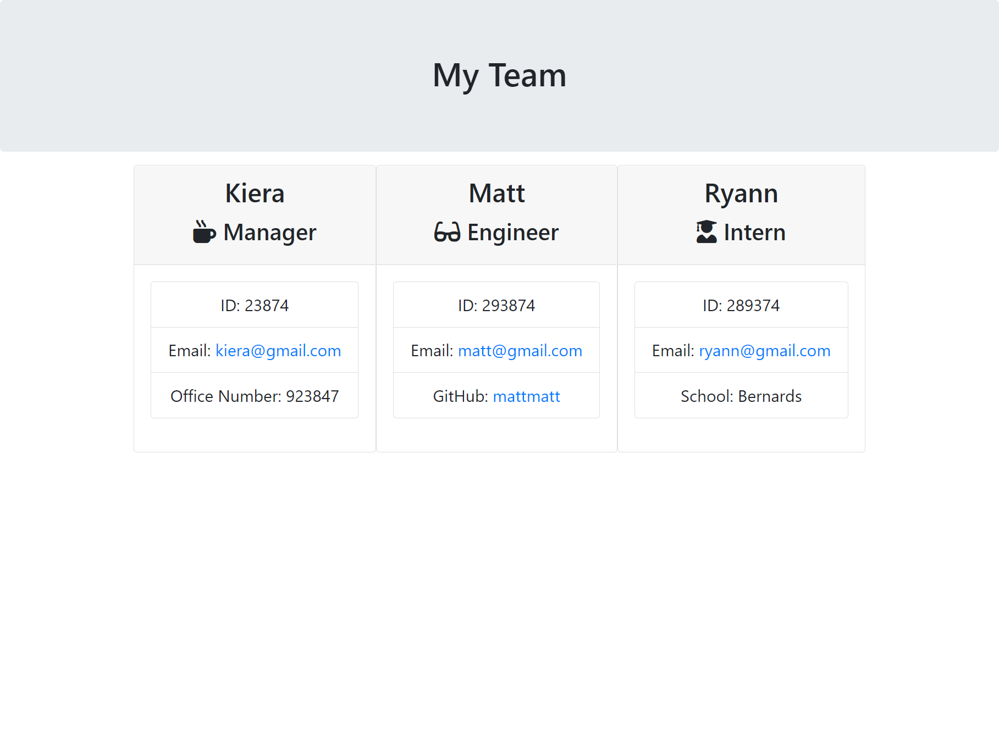

# Template Engine - Team Generator

This Node CLI incorporates HTML, JS, Node.js and Inquirer to output an HTML page displaying the users team members. 

The `inquirer.js` npm package creates the CLI (Command Line Interface) tools to handle the user input. In order to run this program, use `node app.js` or `node app` in the terminal. Make sure to use a `.gitignore` to avoid pushing unnecessary files (such as the node_modules) to GitHub. Once the app is initiated, the user is prompted for a team members information, including their name, role, ID, and email. when the user selects the option not to continue adding teammates, a file will be generated. This can be found in the 'output' folder called team.html.

# Sample HTML Page

# Implementation Video

